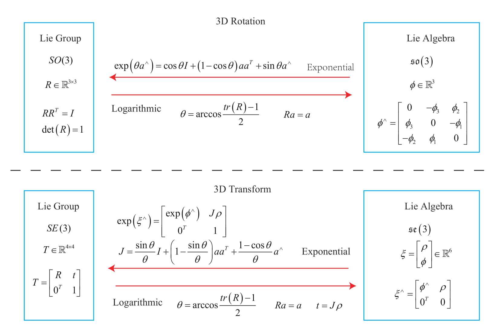

# 4.2 Exponential and Logarithmic Mapping

## 4.2.1 Exponential Map of SO(3)

**How to calculate $$\exp ( \boldsymbol{\phi}^{\wedge} )$$?**

The exponential of an arbitrary matrix can be written as a Taylor expansion if it has converged, whose result is still a matrix:
$$
\exp(\mathbf{A}) = \sum\limits_{n = 0}^\infty {\frac{1}{ {n!}}{ \mathbf{A}^n}}
$$
Similarly, for any element in $$\boldsymbol{\phi} \in \mathfrak{so}(3)$$:
$$
\exp(\boldsymbol{\phi}^\wedge) = \sum\limits_{n = 0}^\infty {\frac{1}{ {n!}}{ (\boldsymbol{\phi}^{\wedge })^n}}
$$
Since $\boldsymbol{\phi}$ is a three-dimensional vector, we can define its length and direction,  denoted as $\theta$ and $\mathbf{n}$, respectively. So we have $\boldsymbol{\phi} = \theta \mathbf{n}$, where $\mathbf{n}$ is a unit-length direction vector, i.e., $\| \mathbf{n} \| =1$

**Rodrigues' formula**
$$
\exp( \theta \mathbf{n}^\wedge ) = \cos \theta \mathbf{I} + (1 - \cos \theta )\mathbf{n}{\mathbf{n}^T } + \sin \theta {\mathbf{n}^ \wedge }.
$$
This shows that $\mathfrak{so}(3)$ is actually the *rotation vector*, and the exponential map is just Rodrigues' formula.

**Logarithmic**
$$
\theta = \arccos ( \frac{\mathrm{tr}(\pmb{R}) - 1}{2}  ) .
$$

$$
\pmb{R} \pmb{n} = \pmb{n}.
$$

## 4.2.2 Exponential Map of SE(3)

$$
\begin{align}
\exp \left( { { \boldsymbol{\xi} ^ \wedge }} \right) &= \left[ {\begin{array}{*{20}{c}}
    {\sum\limits_{n = 0}^\infty {\frac{1}{ {n!}}{ {\left( { {\boldsymbol{\phi} ^ \wedge }} \right)}^n} } }&{\sum\limits_{n = 0}^\infty {\frac{1}{ {\left( {n + 1} \right)!}}{ {\left( { {\boldsymbol{\phi } ^ \wedge }} \right)}^n} \boldsymbol{\rho} } }\\
    { {\mathbf{0}^T}}&1
    \end{array}} \right] \\
&\buildrel \Delta \over = \left[ {\begin{array}{*{20}{c}}
    \mathbf{R} &{\mathbf{J\rho} } \\
    { {\mathbf{0}^T}}&1
    \end{array}} \right] = \mathbf{T}.
\end{align}
$$

$$
\mathbf{J} = \frac{ {\sin \theta }}{\theta } \mathbf{I} + \left( {1 - \frac{ {\sin \theta }}{\theta }} \right) \mathbf{a} { \mathbf{a}^T} + \frac{ {1 - \cos \theta }}{\theta }{ \mathbf{a}^ \wedge }.
$$

**Logarithmic**
$$
\theta = \arccos ( \frac{\mathrm{tr}(\pmb{R}) - 1}{2}  ) .
$$

$$
\pmb{R} \pmb{n} = \pmb{n}.
$$

$$
\mathbf{t} = \mathbf{J} \boldsymbol{\rho}.
$$

## Summary

