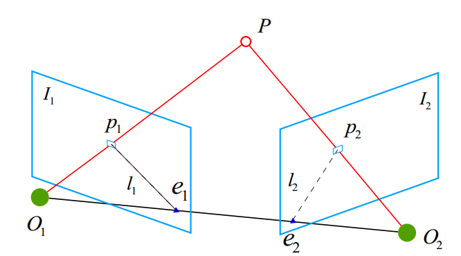

# 2D-2D: epipolar geometry

$$p_1, p_2$$ are projections of the same point in space on two image planes.

Define the spatial position of $$P$$ in the first frame to be:
$$
P = [X, Y, Z]^T
$$
According to the poinhole camera model, we know the pixel positions of the two pixels $$p_1, p_2$$ are:
$$
s_1p_1 = KP, s_2p_2 = K(RP + t)
$$
where $$K$$ is the camera intrinsic parameters matrix, $$R,t$$ are the camera motions between two camera frames.