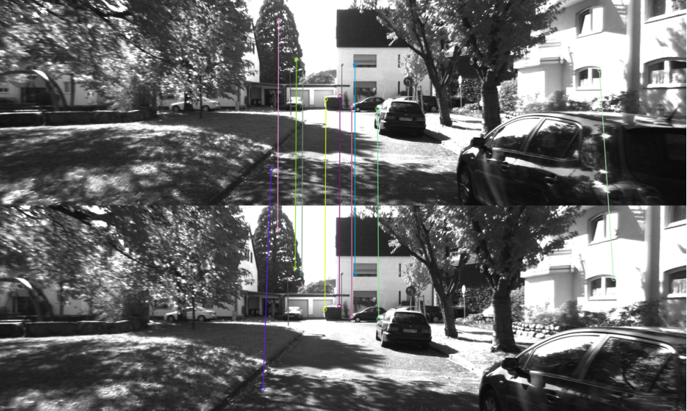

# Feature Matching

Feature matching solves the data association problem in SLAM: determine the current view correspondence between the landmarks (feature points) and the landmarks (feature points) seen before.

## 1. Brute-Force Matcher

Step 1: Measure the distance between each feature point $$x_t^m$$ and all $$x^n_{t+1}$$ descriptors, and then 

Step 2: Sort by **degree of similarity** of two features.

​	For descriptors of floating-point type, use Euclidean distance to measure

​	For binary descriptors (such as BRIEF), use Hamming distance  : the number of different digits.

Step 3: Take the closest one as the matching point. 

## 2. Fast Approximate Nearest Neighbor (FLANN)

When the number of feature points is very large, we can use **Fast Approximate Nearest Neighbor**.