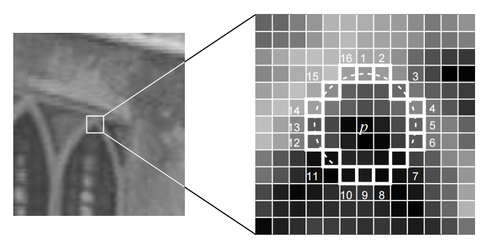

# Visual Odometry: Part 1

VO **estimates the rough camera movement** based on the information of the consecutive images, and provides a good initial value of the back end.

VO are mainly divided into two categories: **feature point method** and **direct method.**

## 1. Feature Point Method

### 1.1 Feature Point

1. Select some representative feature points from the image.  These points will remain the same after a small change in the camera's angle of view, so that we can find the same points in each image.
2. On the basis of these points, the problem of camera pose estimation and the positioning of these points are discussed.

**Feature** is another digital expression of image information.

In visual odometry, we hope that feature points **remain stable after the camera moves**.

#### 1.1.1 Corners

Therefore, an intuitive way to extract features is to identify **corners** in different images and then determine their correspondence.

Algorithms:

Harris corner, FAST corner, GFTT corner

#### 1.1.2 More stable local features

Simple corner points are variant to scales.  So there are more stable local image features:

SIFT, SURF, ORB

#### **1.1.3 Feature Point Properties**:

1. Repeatability: The same feature can be found in different images.
2. Distinctiveness: Different features have different expressions.
3. Efficiency: In the same image, the number of feature points should be far smaller than the number of pixels.
4. Locality: The feature is only related to a small image area.

#### 1.1.4 A feature point is composed of two parts:

- **Key-point**: position of the feature point in the image, and some types of feature points also hold information such as orientation and size.
- **Descriptor**: usually a vector, describing the information of the pixels around the key point according to some handcrafted rules. Features with similar appearance should have similar descriptors.

#### 1.1.5 Some Popular Feature Point Methods

| Method                                   | Feature Point | Descriptor    | Speed | Summary                                                      |
| ---------------------------------------- | ------------- | ------------- | ----- | ------------------------------------------------------------ |
| SIFT (Scale-Invariant Feature Transform) | SIFT          | SIFT          | Slow  | Fully consider the changes in illumination, scale and rotation |
| FAST key point                           | FAST          | N/A           | Fast  | A feature point that is extremely fast to calculate.  No descriptor. No direction information |
| ORB (Oriented FAST and Rotated BRIEF)    | Oriented FAST | Rotated BRIEF | Fast  | It solves the problem that FAST detector does not have directionality, and uses the extremely fast binary descriptor BRIEF. |

## 2. ORB Feature

ORB features are composed of two parts: key points and descriptor. 

Two steps:

- **Key point**: **Oriented FAST**. Compared with the original FAST, the main direction of the feature points is calculated
- **Descriptor: BRIEF** (Binary Robust Independent Elementary Feature) .  Describe the surrounding image area where the feature points were extracted in the previous step.  ORB has made some improvements to BRIEF, mainly referring to utilizing the previously calculated direction

### 2.1 FAST Key points

FAST is a kind of corner point, which mainly detects the obvious grayscale changes locally, and is known for its fast speed.

#### 2.1.1 Main Idea

If a pixel is very different from the neighboring pixels (too bright or too dark), then it is more likely to be a corner points. 

Compared with other corner detection algorithms, FAST only needs to compare the brightness of the pixels, which is very fast.

#### 2.1.2 Entire Procedure

1. Select pixel $$p$$ in the image assuming its brightness as $$I_p$$
2. Set a threshold $$T$$ (for example, 20% of $$I_p$$)

3. Take the pixel $$p$$ as the center, and select the 16 pixels on a circle with a radius of 3.
4. If there are consecutive N points on the selected circle whose brightness is greater than $$I_p + T$$ or less than $$I_p - T$$, then the central pixel $$p$$ can be considered as a feature point ($$N$$ usually takes 12, which is FAST-12).
5. Iterate though the above four steps on each pixel.

#### 2.1.3 Good

- In the FAST-12 algorithm, to speed up, checking the brightness of the 1, 5, 9, and 13-th pixels on the circle for each pixel can quickly exclude a lot of pixels that are not corner points.  Only when 3 out of 4 pixels are greater than $$I_p + T$$ or less than $$I_p - T$$, may the current pixel be a corner points, otherwise it should be excluded directly.  Such 'pre-processing' operation greatly accelerates FAST corner detection.

- Non-maximal suppression:  the original FAST corners are often ”clustered”, meaning a lot of FAST corners present in the same area. Therefore, after the initial detection, non-maximal suppression is required. Only corner points with maximum response in a certain area will be retained to avoid the corners concentrating.

#### 2.1.4 Bad

- The calculation of FAST feature points only compares the brightness difference between pixels, thus the speed is very fast, but it suffers from bad repeatability and uneven distribution. 
- FAST corner points do not include direction information. 
- It fixed the radius of circle as 3, there is also a scaling problem: a place that looks like a corner from a distance may not be a corner when it comes close. 

### 2.2 Oriented FAST Key points

ORB adds the description of scale and rotation. The **scale invariance** is achieved by the image pyramid, and detect corner points on each layer of the pyramid. The **rotation** of features is realized by the Intensity Centroid method.

#### 2.2.1 Image Pyramid

Pyramid is a common approach in computer vision.  The bottom of the pyramid is the original image. For each layer up, the image is scaled with a fixed ratio, so that we have images of different resolutions. The smaller image can be seen as a scene viewed from a distance. In the feature matching
algorithm, we can match images on different layers to achieve scale invariance.

#### 2.2.2 Intensity Centroid

In terms of rotation, we calculate the gray centroid of the image near the feature point.  The so-called centroid refers to the gray value of the image block as the center of weight. The specific steps are as follows

1. In a small image block $$B$$, define the moment of the image block as
$$
m_{pq}=\sum_{x,y \in B}x^{p}y^{q}I(x,y), \quad p, q = \{0,1\}.
$$
2. Calculate the centroid of the image block by the moment:
$$
   C=\left(\frac{m_{10}}{m_{00}},\frac{m_{01}}{m_{00}}\right).
$$
3. Connect the geometric center $$O$$ and the centroid $$C$$ of the image block to get a direction vector $$\overrightarrow{OC}$$, so the direction of the feature point can be defined as
$$
\theta = \arctan(m_{01}/m_{10}).
$$

